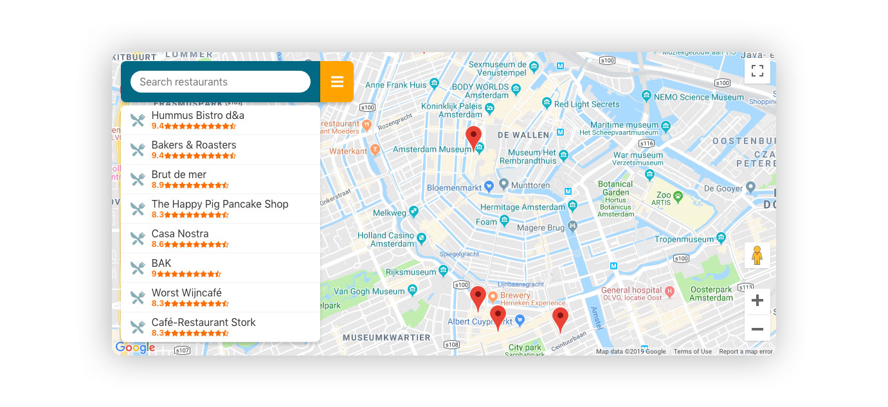

# UDACITY FRONT-END DEVELOPMENT NANODEGREE NEIGHBORHOOD MAP

This is an application that show the best restaurants in Amsterdam, it comes with a filter feature that allows the user to search a restaurant among the ones shown in the application. It uses Forsquare API to show photos of the restaurant.



## Quickstart

Install npm dependencies:

```shell
npm install
```

Run the aplication

```shell
npm start
```

## Resources

-   Udacity Forums
-   Stackoverflow
-   [Google Maps JavaScript API](https://developers.google.com/maps/documentation/javascript/tutorial)
-   [Google-maps-react](https://github.com/fullstackreact/google-maps-react)
